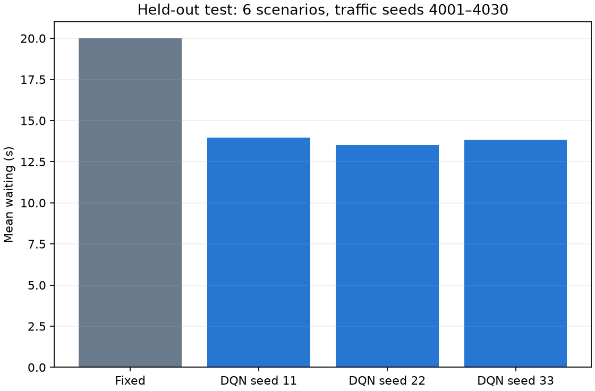
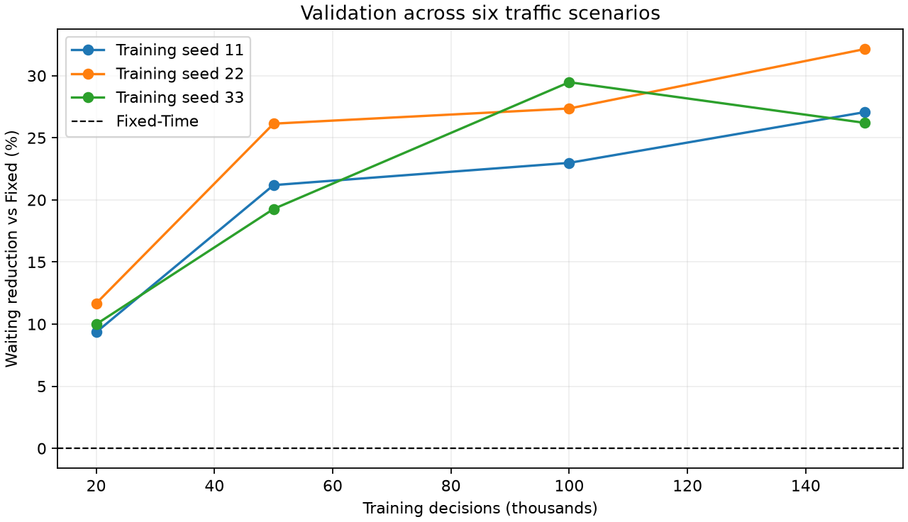

# 다중 학습 시드·학습량 실험 결과

2026-09-18 · 실제 Windows CPU 실행 · SUMO/libsumo/TraCI 1.27.1 · Python 3.12.14 · Stable-Baselines3 2.9.0

**세 학습 시드 모두, 최종 평가 전체 평균에서 Fixed보다 대기시간·Queue·처리량이 개선됐습니다.** 6개 설정 계열, 14개 학습 궤적, 52개 checkpoint를 검증했습니다. 검증 데이터로 150,000스텝 모델 세 개를 확정한 뒤, 사용하지 않은 교통 시드 30개 × 6시나리오에서 총 720 episodes를 실행했습니다. 학습 시드 22 모델을 기본 `results/models/dqn.zip`으로 배치했습니다.

## 최종 결과

아래 DQN은 학습 시드 11·22·33의 동일 가중 평균입니다. 각 시나리오도 동일 가중입니다. 대기시간은 실제 삽입된 모든 차량의 누적 정지 대기시간 평균이며, 처리량은 300초 내 출구까지 도착한 차량 수입니다.

| 지표 | Fixed | DQN 3개 평균 | 변화 | DQN−Fixed 차이의 95% 구간 |
|---|---:|---:|---:|---:|
| 평균 대기시간 | 20.006초 | 13.775초 | **31.15% 감소** | −6.634 ~ −5.832초 |
| 평균 Queue | 16.464대 | 12.834대 | **22.04% 감소** | −4.036 ~ −3.251대 |
| 처리량 | 173.983대 | 185.567대 | **6.66% 증가** | +9.783 ~ +13.346대 |
| episode별 최대 대기시간의 평균 | 95.322초 | 89.541초 | 6.07% 감소 | −10.120 ~ −0.997초 |
| 삽입되지 못한 차량 | 2.861대 | 0.272대 | 감소 | −3.100 ~ −2.111대 |

평균 대기만 낮추고 차량을 덜 통과시키는 방식인지 확인하기 위해 Queue, 처리량, 미삽입 차량을 함께 비교했습니다. 주요 세 지표의 구간 모두 개선 방향이며, 사전 목표인 평균 대기 5% 이상 감소도 넘었습니다.

| 학습 시드 | 학습 decisions | 평균 대기시간 | 대기 감소 | Queue 감소 | 처리량 증가 |
|---|---:|---:|---:|---:|---:|
| 11 | 150,000 | 13.962초 | 30.21% | 20.86% | 5.64% |
| **22 · 기본 모델** | 150,000 | **13.528초** | **32.38%** | **24.26%** | **7.61%** |
| 33 | 150,000 | 13.834초 | 30.85% | 21.00% | 6.72% |

각 모델은 180쌍 중 151쌍(83.89%)에서 Fixed보다 평균 대기가 짧았습니다. 모든 개별 교통 상황에서 우세하다는 뜻은 아닙니다.



원본: [모델별 비교](results/heldout_approach/model_comparison.csv), [통계 JSON](results/heldout_approach/analysis/statistics.json), [540개 paired 비교](results/heldout_approach/analysis/paired_cases.csv).

## 시나리오별 결과와 예외

아래는 세 DQN 평균입니다. 변화율은 DQN−Fixed이며, 대기·Queue는 음수일 때 개선입니다.

| 시나리오 | Fixed 대기 | DQN 대기 | 대기 변화 | Queue 변화 | 처리량 변화 |
|---|---:|---:|---:|---:|---:|
| balanced | 11.567초 | 7.348초 | −36.48% | −36.54% | +1.31% |
| ns_heavy | 21.107초 | 10.082초 | −52.23% | −52.04% | +9.90% |
| ew_heavy | 20.414초 | 9.574초 | −53.10% | −53.07% | +12.24% |
| left_heavy | 26.842초 | 15.734초 | −41.38% | −36.04% | +14.79% |
| heavy | 30.952초 | 32.944초 | **+6.44%** | **+6.51%** | +0.98% |
| low | 9.157초 | 6.966초 | −23.93% | −24.28% | **−1.25%** |

전 방향 고수요 `heavy`에서는 평균 대기와 Queue가 오히려 증가했고, 최대 대기의 평균도 125.20초에서 172.93초로 늘었습니다. `low`에서는 처리량이 40.067대에서 39.567대로 소폭 감소하고, 최대 대기 평균은 28.85초에서 40.14초로 증가했습니다. 기본 seed 22도 `heavy`의 평균 대기는 약 2.94% 증가합니다. 따라서 결론은 **이 여섯 시나리오의 동일 가중 전체 평균 개선**입니다. 모든 혼잡 조건의 개선이나 대기 상한을 주장하지 않습니다.

학습은 방향별 발생률 150~1500대/시간의 무작위 수요를 사용했고, `heavy`는 각 방향 1600대/시간으로 학습 발생률 범위 밖입니다. 위 차이의 가능한 이유지만, 이번 실험만으로 원인을 확정할 수 없습니다. 최종 데이터를 본 뒤 유리한 시나리오만 제외하거나 모델을 다시 선정하지 않았습니다.

원본: [시나리오 비교](results/heldout_approach/analysis/scenario_comparison.csv), [개별 모델×시나리오](results/heldout_approach/analysis/by_model_scenario.csv).

## 학습량과 실패한 시도

각 checkpoint는 같은 궤적의 중간 저장이며 서로 독립적으로 시작한 단기 학습이 아닙니다. 검증용 교통 시드는 3001~3005입니다. 다음 표는 각 계열의 마지막 평가 학습량에서 학습 시드 평균이며, 감소율이 음수면 악화입니다. 전체 중간 결과는 CSV에 남겼습니다.

| 계열 | 시드 수 | 마지막 평가 학습량 | 대기 감소율 | Queue 감소율 | 처리량 변화 | 기준 충족 |
|---|---:|---:|---:|---:|---:|---|
| original/default | 3 | 200,000 | −37.54% | −32.26% | −23.99% | 실패 |
| 전환 벌점 1.0 | 3 | 200,000 | −21.02% | −21.29% | −18.15% | 실패 |
| 전환 벌점 + 5-step return | 1 | 200,000 | −19.58% | −18.07% | −12.52% | 실패 |
| Queue 중심 보상·정규화 | 1 | 100,000 | +3.72% | −2.69% | −5.77% | 실패 |
| 탐색 액션 5~17스텝 유지 | 3 | 100,000 | −3.64% | −13.57% | −4.53% | 실패 |
| 위 설정 + 접근 차량 관측 | 3 | 150,000 | **+28.47%** | **+19.36%** | **+5.71%** | **3개 시드 모두 성공** |

초기 default는 300,000까지 계획했으나 200,000 checkpoint까지 모두 실패하여 중단했습니다. 프로세스를 멈출 때까지 진행한 약 21만~23만 스텝 중 20만 이후 미저장 구간은 평가하지 않았습니다. 그 외 최종 저장 학습량을 합하면 225만 decisions이며, 이 추가 구간까지 포함한 실제 계산량은 더 큽니다. 52개 checkpoint는 12 + 12 + 4 + 3 + 9 + 12개입니다.

선정 계열의 학습량별 검증 결과:

| 학습량 | 세 시드 평균 대기 감소 | Queue 감소 | 처리량 증가 | 세 시드 모두 기준 충족 |
|---|---:|---:|---:|---|
| 20,000 | 10.34% | −1.05% | 0.47% | 아니오 |
| 50,000 | 22.20% | 12.11% | 4.00% | 예 |
| 100,000 | 26.61% | 16.20% | 4.67% | 예 |
| 150,000 | **28.47%** | **19.36%** | **5.71%** | **예** |



모든 시드가 세 지표 기준을 통과한 공통 학습량 중, 검증 평균 대기가 가장 낮은 150,000을 선정했습니다. 그중 검증 대기가 가장 낮은 seed 22를 기본 모델로 정했습니다. 최종 평가 결과는 선정에 사용하지 않았습니다.

원본: [전체 52개 결과](results/experiment_leaderboard.csv), [학습량별 통계](results/experiment_budget_summary.csv), [변경 이력](experiments/PROTOCOL.md), [확정 모델 해시](experiments/frozen_selection.json).

## 무엇을 바꿨는가

정지 차량 Queue는 차가 가속하면 바로 줄어듭니다. 교차로를 아직 통과하지 않은 차량도 Queue에서 사라지므로, Queue만 보는 정책이 너무 일찍 녹색을 끝내는 현상을 의심했습니다. 기존 26차원에 정지선 50m 이내에서 움직이는 차량의 8그룹 수를 추가했습니다. 현재 관측은 34차원이며 미래 수요나 경로 예측은 주지 않습니다.

Queue 정규화는 그룹당 40대에서 10대, 총 대기·최대 대기 reward 가중치는 각각 0.3/0.5에서 0.1/0.1로 조정했습니다. 학습률 3e-4, gamma 0.95, 5-step return, 무작위 탐색 액션 유지 5~17 decisions를 사용합니다. 무작위로 매우 자주 전환하는 탐색에서 긴 녹색을 경험하기 어렵다는 문제에 대응했습니다. 평가 action은 학습된 DQN의 greedy 출력이며, 신호 시간 제한은 기존 SignalController가 그대로 적용합니다.

각 변경의 독립적 인과 효과를 확정하는 완전한 ablation 실험은 아닙니다. 단순 학습량 증가·전환 벌점 증가만으로 해결되지 않았고, 최종 관측·보상·탐색 조합에서 반복 성공했다는 근거입니다. 별도 Queue 휴리스틱은 문제 진단에만 사용했고, DQN의 학습 action·교사 시연·추론 action으로 사용하지 않았습니다.

## 공정한 비교와 통계

- 학습 RNG: 11, 22, 33. 학습 교통 시드: 1~1000. 검증: 3001~3005. 최종: 4001~4030.
- 모델·학습량·선정 규칙을 2026-09-18 06:14:46 UTC에 해시와 함께 확정한 뒤 최종 평가를 실행했습니다.
- Fixed 180회 + DQN 3개 × 180회 = 실제 실행 720회입니다. Fixed를 모델마다 다시 독립 표본으로 세지 않았습니다.
- 같은 scenario/seed의 route XML SHA-256과 SUMO seed가 일치합니다. 각 모델 180개 조건을 모두 평가했습니다.
- 네트워크, 수요, 차량 특성, 300초 episode/240초 수요, 최소 녹색 3초, 최대 녹색 15초, 황색 1초, 전적색 1초, Fixed [10,4,10,4]초를 바꾸지 않았습니다.
- 95% 구간은 paired DQN−Fixed 차이에 대한 10,000회 bootstrap입니다. 학습 모델과 교통 시드를 각각 재표집하고, 같은 교통 시드의 여섯 시나리오를 함께 유지했습니다. 세 학습 시드만 사용하므로 알고리즘의 모든 학습 변동성을 정밀하게 추정했다고 볼 수는 없습니다. 다양한 도로에 대한 신뢰구간도 아닙니다.
- 52개 checkpoint를 확인한 검증 데이터의 점수는 일반화 근거로 삼지 않았습니다. 최종 seed 범위는 모델 확정 전에 확인하지 않았습니다. 이후 튜닝에 이 결과를 쓰면 새 최종 seed 범위를 별도로 확보해야 합니다.

## 실행 검증과 한계

자동 테스트 **24개 통과**, 최종 기본 설정의 SB3 `check_env` 통과, `pip check` 의존성 오류 없음. 추가로 확정한 모델을 실제 TraCI에서 교통 seed 4001 × 6시나리오 × Fixed/DQN = 12회 재현하여 libsumo의 모든 수치 metric 및 경로 해시가 정확히 일치함을 확인했습니다. 원래 26차원과 추가 관측 34차원 모두 backend 관측·보상 일치 테스트를 통과합니다. [검사 기록](results/heldout_approach/analysis/audit.json), [TraCI 결과](results/traci_final_check/episodes.csv).

최종 720 episodes에서 감지한 **충돌 0, 텔레포트 0**입니다. 다만 긴급 제동/적색 신호 긴급 정지 경고가 남아 있습니다.

| 제어기 | 180 episodes의 긴급 제동 경고 | 긴급 정지 경고 |
|---|---:|---:|
| Fixed | 12 | 11 |
| DQN seed 11 | 15 | 15 |
| DQN seed 22 | 12 | 12 |
| DQN seed 33 | 11 | 11 |

이는 SUMO 로그의 경고 줄 수이며, 한 사건에 두 경고가 함께 발생할 수 있어 합계를 고유 사건 수로 해석하면 안 됩니다. [경고 집계](results/heldout_approach/analysis/warnings.csv). 초기부터 사용한 짧은 황색 등 물리 설정은 비교 중 바꾸지 않았습니다. 실도로 신호 안전성을 검증한 결과가 아니며, 실제 적용 전 황색·소거 시간과 도로 속도·구조를 함께 검토해야 합니다.

현재 결론은 합성 단일 교차로와 300초 episode에 한정됩니다. 장시간 과포화, 보행자, 비상 차량, 실제 카메라 검출 오류·지연은 이번 학습·평가에 포함하지 않았습니다. 캡스톤의 시뮬레이션 성능 결과로 사용하고, 하드웨어로 옮길 때는 34개 관측의 단위와 접근 영역 정의를 맞춰야 합니다.

## 바로 실행하기

프로젝트 폴더 `traffic-rl`에서 현재 PC의 가상환경으로 실행합니다.

```powershell
# 선정 모델 GUI 시연
..\.venv\Scripts\python.exe run_model.py --gui --delay 0.03 --scenario ns_heavy --seed 4001

# 선정 모델 평가 재현: 이미 사용한 시드이므로 새 독립 검증은 아님
..\.venv\Scripts\python.exe evaluate.py --model results/models/dqn.zip --backend libsumo --seed-start 4001 --episodes 30 --output results/evaluation_repeat

# 저장된 결과·모델·TraCI 일치 재검사
..\.venv\Scripts\python.exe verify_final.py
```

선정 모델·설정·재개용 replay buffer는 `results/models/dqn.*`에, 나머지 두 모델은 `dqn_s11.*`, `dqn_s33.*`에 있습니다. 원래 설정은 `experiments/default_reference.json`에 보존했습니다. 새 학습은 검증된 모델을 덮어쓰지 않도록 별도 `--model` 경로를 지정하세요. 상세 설치·새 학습 명령은 [README.md](README.md)를 참고하세요.
